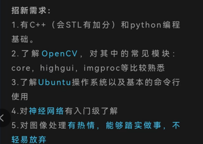
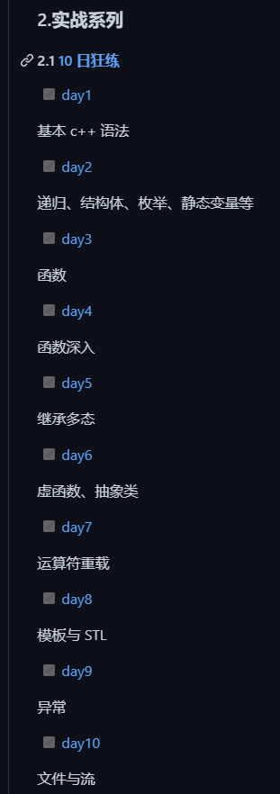

**注：以下的需求也不需要百分百符合，即使什么都不懂，只要你不厌恶学这些，也可以报名，是有机会入队，这些东西都很容易掌握的。**
对如下招新需求的说明

* C++基础：能够完成 [C++ 那些事](https://github.com/Light-City/CPlusPlusThings?utm_source=wechat_session&utm_medium=social&utm_oi=1127172663159918592) 里的（day4,day6,day9可以忽略）:
 
* python基础： https://b23.tv/90SYvD2 。能理解这个视频提到的概念就行。
* opencv:[【4h上手C++版Opencv-哔哩哔哩】](https://b23.tv/7Ftg84Y)。能理解这个视频提到的概念就行。
* ubuntu：[MIT 计算机科学课堂中学不到的知识](https://b23.tv/tODhrH6)。了解lecture1和lecture2的内容即可。
* 神经网络：了解这3个视频的概念即可。
 